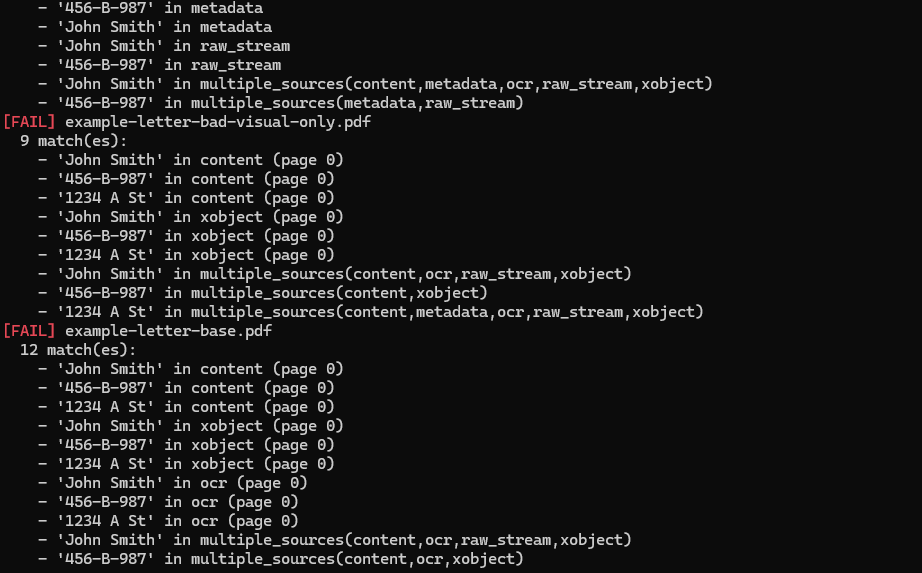
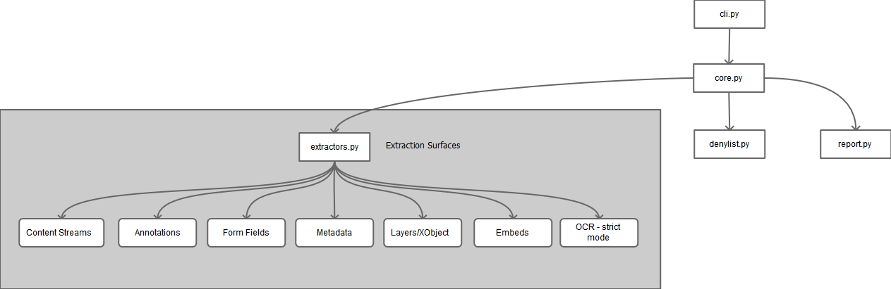

# redact-verify

A minimal, defensive CLI tool that verifies whether a supposedly redacted PDF actually contains no recoverable sensitive information.

## What it is

- A verification tool for redacted PDFs
- Analyzes all text-bearing surfaces (content, annotations, metadata, form fields, layers, embedded objects)
- Optionally performs OCR to detect visually recoverable text
- CI-friendly with deterministic exit codes



## Key Features

- **Comprehensive extraction**: Scans content streams, annotations, form fields, metadata, hidden layers (OCG), embedded objects, XObjects, and raw PDF streams
- **Cross-fragment matching**: Detects sensitive data split across multiple fragments or encoding boundaries
- **OCR support**: Optional OCR to catch rasterized or visually-only text
- **Security-focused**: No "safe" sources—all extracted text is checked against denylist patterns
- **Deterministic**: Same input always produces same output
- **CI/CD ready**: JSON output and exit codes for automation

## Architecture



## What it is not

- Not a redaction tool
- Not a PDF editor
- Not a document transformer
- **Never modifies files** — analyze-only

## Installation

```bash
pip install -e .
```

For OCR support:

```bash
pip install -e ".[ocr]"
```

## Usage

### Basic verification

Structural-only verification (checks if document is readable):

```bash
redact-verify document.pdf
```

### Denylist verification

Single token:

```bash
redact-verify document.pdf --deny "secret phrase"
```

Multiple tokens:

```bash
redact-verify document.pdf --deny "John Doe" --deny "555-1234"
```

From file:

```bash
redact-verify document.pdf --denyfile denylist.txt
```

### Denylist file format

```text
# Lines starting with # are comments
sensitive string
another literal match
regex:[A-Z]{2}\d{6}
regex:\b\d{3}-\d{2}-\d{4}\b
```

### Strict mode

Enable OCR and additional structural checks:

```bash
redact-verify document.pdf --deny "secret" --strict
```

### OCR modes

```bash
redact-verify document.pdf --ocr=off      # No OCR (default)
redact-verify document.pdf --ocr=auto     # OCR if redaction regions detected
redact-verify document.pdf --ocr=always   # Always perform OCR
```

### Batch mode

Process multiple files in parallel:

```bash
redact-verify ./docs/*.pdf --strict --jobs 8
```

### JSON output

For CI integration and audit trails:

```bash
redact-verify document.pdf --strict --json > report.json
```

## Exit Codes

| Code | Meaning |
|------|---------|
| 0 | Pass — no leakage detected |
| 1 | Fail — leakage found |
| 2 | Error — malformed or unreadable document |

## Design Principles

- **Analyze-only**: Never modifies input files
- **Fail-closed**: Errors produce exit code 2, not silent passes
- **Deterministic**: Same input always produces same output
- **CI-friendly**: Exit codes and JSON output for automation
- **Text-focused**: Detects recoverable semantic text, not visual-only obfuscation

## Test Fixtures

The `samples/` directory contains test PDFs for validation:

### Files That Should FAIL (Text Leaks Detected)

- `example-document-ocr_raster.pdf` - Rasterized text (detected via OCR)
- `example-letter-bad-comment.pdf` - Sensitive data in annotations
- `example-letter-bad-formfield-leak.pdf` - Sensitive data in form fields and metadata
- `example-letter-bad-metadata-leak.pdf` - Sensitive data in document metadata
- `example-letter-bad-visual-only.pdf` - Visual-only text overlay (detected via OCR)
- `example-letter-base.pdf` - Unredacted base document with all sensitive data visible

### Files That Should PASS (No Recoverable Text)

- `example-letter-redacted.pdf` - Properly redacted document (correctly passes)
- `example-letter-bad-layerleak.pdf` - Visual-only layer deception
  - LibreOffice converts text to vector paths/outlines in hidden layers
  - Contains no recoverable text operators or readable strings
  - Correctly identified as PASS (visual deception, not text leakage)
- `example-letter-embeddedleak.pdf` - Binary embedded object
  - Embedded object contains no text operators or readable strings
  - Binary/compressed data with no semantic text content
  - Correctly identified as PASS (no recoverable text)

### Important Note

The tool distinguishes between **visual-only obfuscation** (vector paths, outlines, binary data) and **actual recoverable text leakage**. Some "bad" fixtures may PASS because they contain visual deception rather than extractable text. This is correct behavior—the tool detects recoverable semantic text, not visual-only content.

## Use Case

Release gating for sensitive documents. If `redact-verify` fails, the document does not ship.

Common scenarios:
- Legal document redaction verification
- FOIA request preparation
- Compliance auditing
- Pre-publication security checks

## Technical Highlights

- **Adversarial extraction**: Designed to find text that attackers could extract, not just what's visible
- **Visibility-agnostic**: Hidden layers, unrendered XObjects, and embedded content are all checked
- **Fragment reassembly**: Handles text split across PDF structures or encoding boundaries
- **Distinguishes visual obfuscation**: Correctly identifies vector paths/outlines vs. recoverable text

## Development

Install with dev dependencies:

```bash
pip install -e ".[dev]"
```

Run tests:

```bash
pytest
```

## Samples

You can run the samples by executing the `run-samples.BAT file.`
You can view more information on the samples here: [SAMPLES.md](docs/SAMPLES.md)

## License

MIT License - see [LICENSE](./LICENSE.md) file for details.

